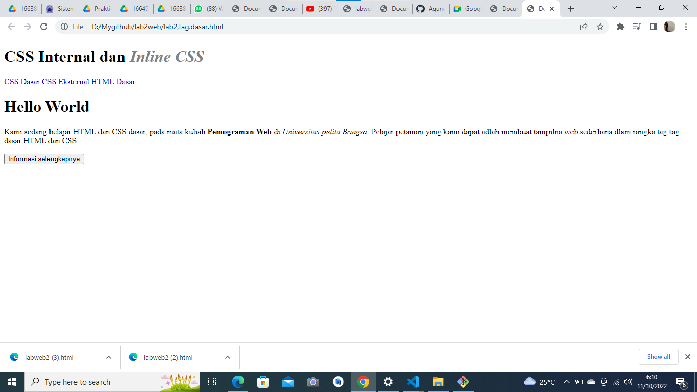
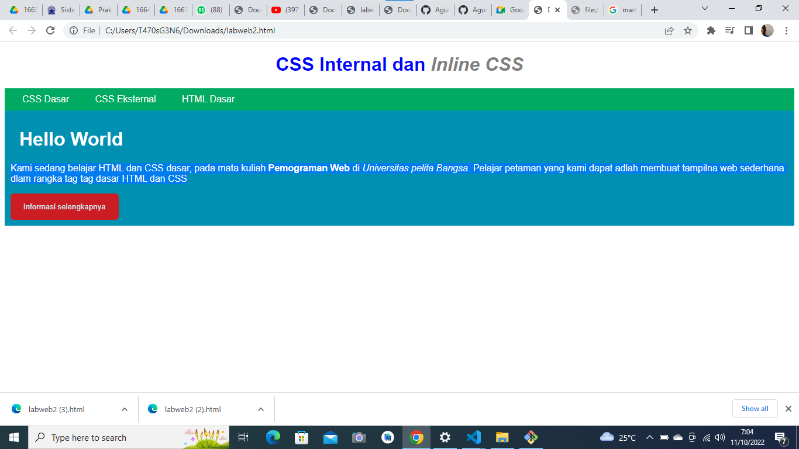

# lab2web
# belajar css

# membuat header 
 dengan menggunakan `<h1>` dan #intro `
`

# lab2web
# Apabila ada deklarasi CSS secara internal, lalu ditambahkan CSS eksternal dan inline CSS pada elemen yang sama 

menggunakan tag '[i]' dalam deklarasi head dengan menggunkan tag [1]

# lab2web
# Pada sebuah elemen HTML terdapat ID dan Class, apabila masing-masing selector tersebut terdapat deklarasi CSS, maka deklarasi manakah yang akan ditampilkan pada browser?
# terdapat elemen class pada paragram
menggunkan tag pada header dan paragraf [i] dan [color;grey]
ini tampilan nya
